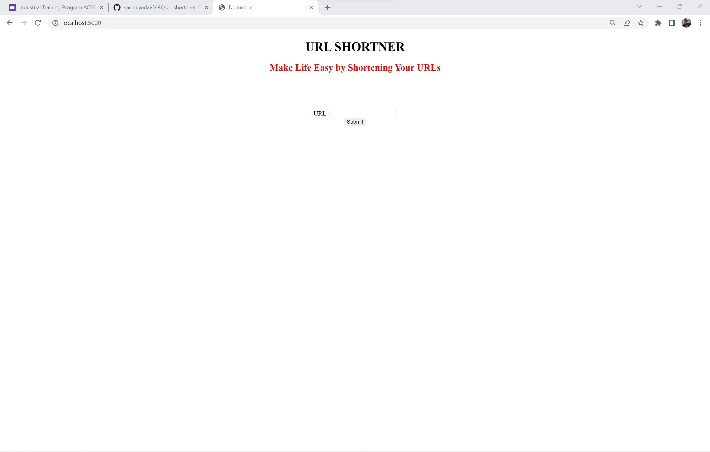
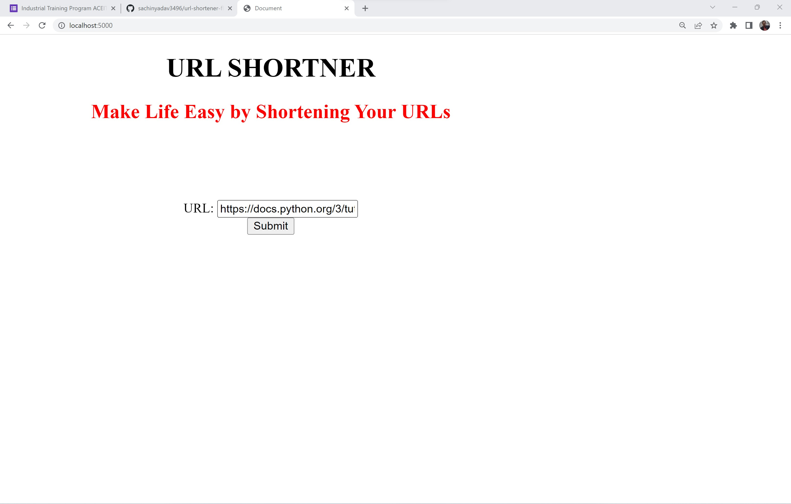
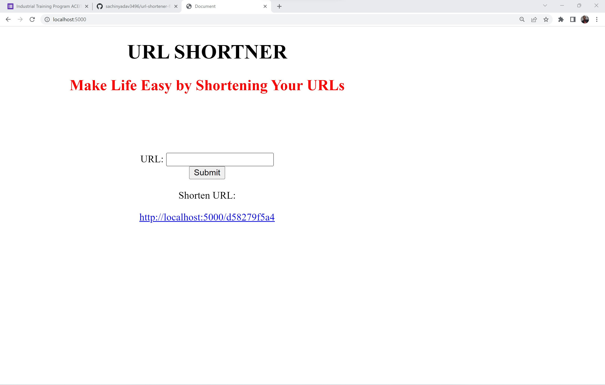
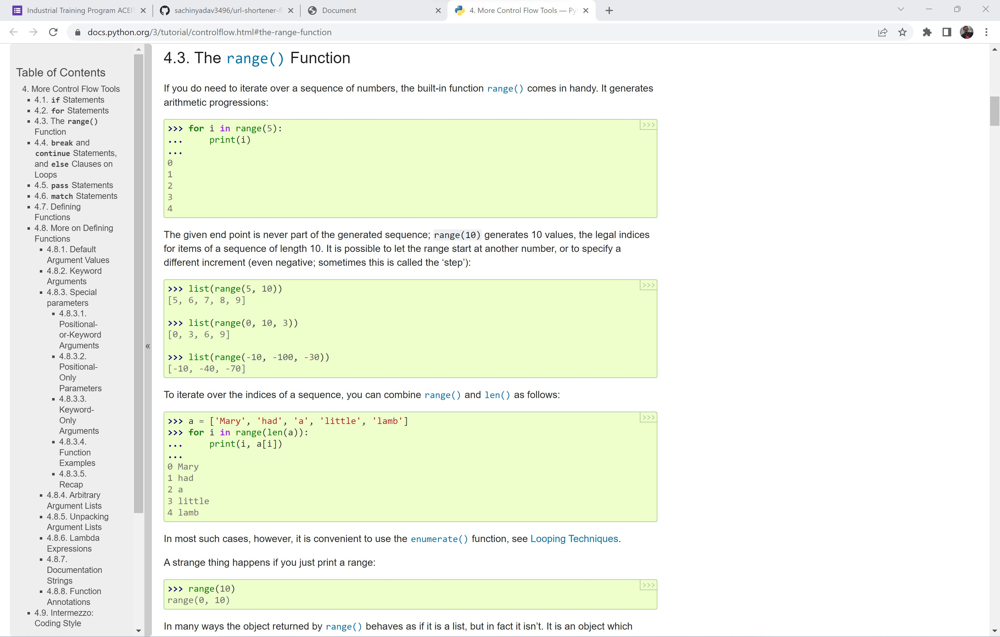

# url-shortener-flask-app

        A Basic Application of which takes long urls and return shorten URLS

        It stores Original URLS in Data Base so it prevents generating multiple shorten URLS for same original URL

#### how to run code 

    step1: Install Python in your system
    
    step2: Install Flask package in python using following command

        `python -m pip install flask`

    step3: Open Terminal in Project Directory and Run Following Command to Run Flask Application

        `python app.py`

    step4: Open Browser and Go to `localhost:5000` and have fun! 

#### Take a Look How it works 

##### Home Page

##### URL to make it  short

##### Shorten URL 

##### Resultant Page

##### Here is Demo Video of Project 
